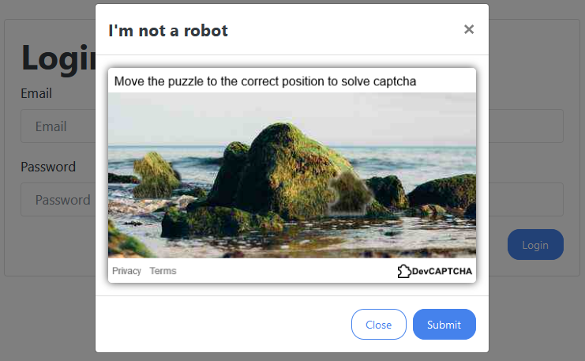
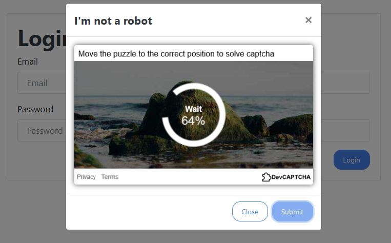
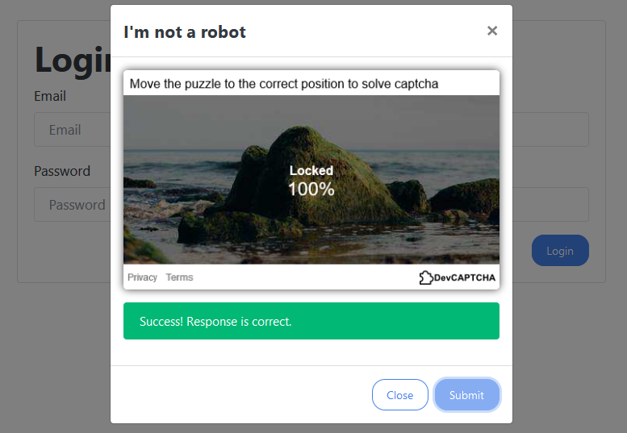

# devcaptcha
Open source captcha made with React, Node and TypeScript for DEV.to community 







### Blog series
[Part 1 - Architecture](https://dev.to/meatboy/create-your-own-captcha-with-react-node-part-1-architecture-1ho7)

[Part 2 - Environment](https://dev.to/meatboy/create-your-own-captcha-part-2-setup-typescript-webpack-and-react-254b)

[Part 3 - React and PIXI.js](https://dev.to/meatboy/create-your-own-captcha-part-3-canvas-13i8)

[Part 4 - Verify Algorithms and Image Manipulation](https://dev.to/meatboy/create-your-own-captcha-part-4-algorithm-node-typescript-react-53j3)

### Getting started
```bash
git clone https://github.com/pilotpirxie/devcaptcha.git
cd devcaptcha/devcaptcha-server
yarn install
yarn start
```

## Integration

Captcha should be configured equally on the client and backend side to works correctly.


```js
const devcaptcha = new DevCaptcha({
  appendSelector: '#captcha',
  promptText: 'Move the puzzle to the correct position to solve captcha',
  lockedText: 'Locked',
  savingText: 'Wait',
  privacyUrl: 'https://example.com',
  termsUrl: 'https://example.com',
  baseUrl: 'http://localhost:8081',
  puzzleAlpha: 0.9,
  canvasContainerId: 'devcaptcha-container',
  leadingZerosLength: 3,
  workerPath: './worker.js'
});
```

### Client Config Definition:
```
export type CaptchaConfig = {
  appendSelector: string, // place to append
  promptText: string, // text on the top of captcha
  lockedText: string, // text after locking
  savingText: string, // text while solving leading zero challenge
  privacyUrl: string, // url to your privacy policy
  termsUrl: string, // url to your terms of service
  baseUrl: string, // base url of devcaptcha server
  puzzleAlpha: number, // transparency of puzzle
  canvasContainerId: string, // id for a div with canvas
  leadingZerosLength: number, // required number of zeros at the front
  workerPath: string, // path to worker.js file
}
```

### Server Config
```json
{
  "port": 8081,
  "timeout": 8000,
  "apiKey": "WmC8xsPD8jhufzndFF3RykNez5QtjXuZ",
  "maxDistance": 32,
  "leadingZerosLength": 3,
  "challengeCount": 50,
  "challengeLength": 256,
  "backgroundPuzzlePath": "/public/puzzle/1.png",
  "clientPuzzlePath": "/public/puzzle/2.png",
  "backgroundImagesPath": "/public/backgrounds/optimized",
  "backgroundQuality": 25,
  "puzzleWidth": 64,
  "puzzleHeight": 64,
  "maxTTL": 30,
  "forceCleanOpimizedImageCache": false
}
```

### Server Config Definition
```
type ServerConfig = {
  port: number, // port to run server
  timeout: number, // maximum time to respond
  apiKey:  string, // secret api key for verifying response
  maxDistance: number, // maximum distance between client and server puzzles
  leadingZerosLength: number, // required number of zeros at the front
  challengeCount: number, // number of string in leading zero challenge 
  challengeLength: number, // length of single string
  backgroundPuzzlePath: string, // path to the puzzle for composition with a background
  clientPuzzlePath: string, // path to the puzzle for client side
  backgroundImagesPath: string, // path to directory with background images
  puzzleWidth: number, // puzzle width
  puzzleHeight: number, // puzzle height
  maxTTL: number, // time to store user data in redis
  backgroundQuality: number, // quality of output background
  forceCleanOpimizedImageCache: boolean // run optimization on each startup
}
```
